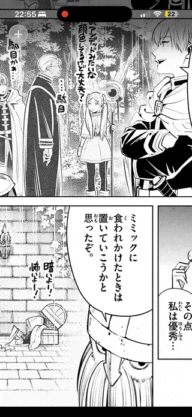

# MangaViewer
A manga viewer for Apple platforms with features for Japanese learners. It relies on [mokuro](https://github.com/kha-white/mokuro) for OCR pre-processing.

## Example of pre-processed manga
You can find an example of a [public domain manga](https://github.com/lovinggrace/MangaViewer/releases/download/example/example-manga.zip 'ブラックジャックによろしく') called ブラックジャックによろしく here.

## Live Text Experiment
The branch `live-text-only` tries to replicate functionality by using Apple's live text. This works reasonable well, but gets confused by furigana.

## Future
This is still very rough and barely a prototype. Things that should be done to make this more usable:

- [ ] Actually design a UI instead of randomly doing stuff
- [ ] Add a library view to add manga to and to launch the viewer from
- [ ] Better dictionaries, word frequency list display, etc.
- [ ] Ability to export words with context to SRS apps (Anki, Migaku, etc.)
- [ ] Clean up code
- [ ] Lots of other stuff

If you  want to help help, feel free.